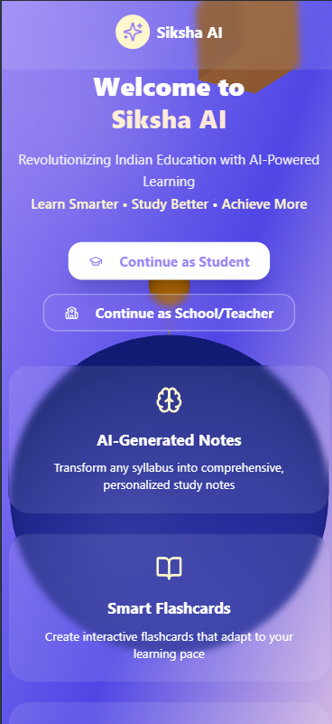
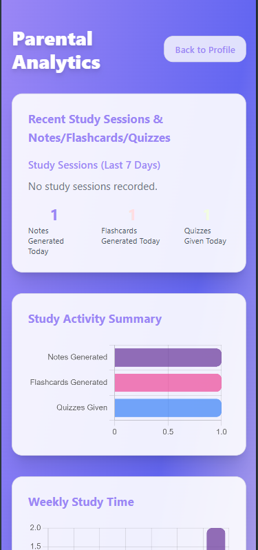
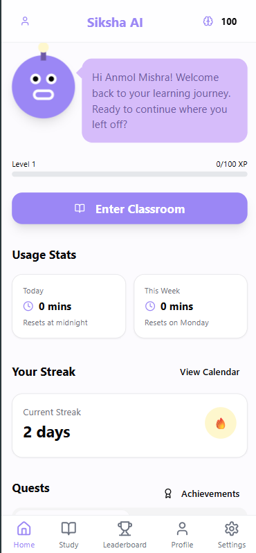
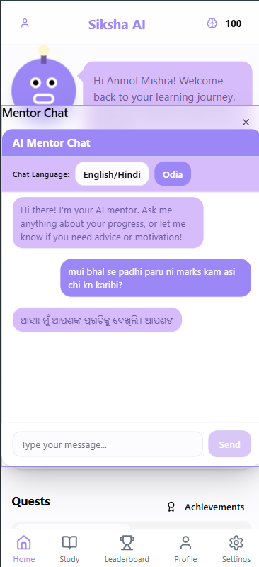

# Siksha AI

Revolutionizing Indian Education with AI-Powered, Gamified & Insight-Driven Learning.

[Live Demo](https://siskshaai.vercel.app/) • **Status:** Under active development – core modules incomplete / evolving.

---

## 1. Vision
Siksha AI aims to make high-quality, personalized learning accessible to every Indian student while empowering parents, teachers, and schools with real-time academic insights. The platform blends:
- AI–generated study assets (notes, flashcards, quizzes)
- Adaptive & gamified progression (XP, levels, streaks, quests, achievements)
- Multilingual mentorship & guidance
- Parent & educator analytics dashboards

---

## 2. Core Feature Pillars
| Pillar | Summary |
|--------|---------|
| AI Study Assets | Convert syllabus/topics into structured notes, flashcards & assessments. |
| Mentor Chat | Conversational AI mentor (supports English / Hindi / Odia) for guidance & motivation. |
| Gamification | XP bar, streak calendar, quests, achievements, leaderboard. |
| Analytics | Parent & teacher dashboards: activity, productivity, study time, asset generation frequency. |
| Classroom Mode | Structured synchronous study & tracking environment. |
| Account Roles | Student, Parent, Teacher/School, Super Admin (role-gated experiences). |

> Many of these are partially implemented and undergoing iteration.

---

## 3. UI Snapshots
(Representative early-development screens – visuals & layout subject to refinement.)

### Landing / Role Entry


### Parental Analytics


### Student Dashboard (Home)


### Mentor Chat (Multilingual)


> If images do not load, ensure you have placed the screenshots under `docs/images/` matching filenames above, or adjust paths.

---

## 4. Tech Stack
| Layer | Tech |
|-------|------|
| Frontend | React 18, TypeScript, Vite, Tailwind CSS, Radix UI, shadcn-inspired components |
| Realtime/Auth | Supabase (PostgreSQL + Auth + Edge Functions potential) |
| Data Viz | chart.js / react-chartjs-2, recharts |
| 3D / Visual | three.js + @react-three/fiber / drei (mascot) |
| Forms & Validation | react-hook-form + zod |
| State / Data | React Query (TanStack), Context API |
| Backend Utility | Node + Express (lightweight server), Supabase client |
| PDF / OCR (Planned / Partial) | tesseract.js, html2pdf.js |

---

## 5. Repository Structure (High-Level)
```
src/
  components/        Reusable UI & feature widgets (XPBar, MentorChat, etc.)
  pages/             Route-level views (Home, Study, ParentAnalytics, etc.)
  context/           Auth & global context providers
  hooks/             Custom hooks (use-mobile, use-toast)
  services/          Domain logic (Achievements, Leaderboard, Notes, ...)
  lib/               Supabase client + utilities
  integrations/      (Future: external service adapters)
public/              Static assets (favicon, placeholders)
supabase/            Config & SQL migrations / analytics scripts
scripts/             Dev tooling (e.g., generate-types)
```

---

## 6. Getting Started (Local Dev)
### Prerequisites
- Node.js >= 18
- Supabase project (URL & anon/service keys)
- pnpm / npm / bun (choose one; examples use npm)

### Environment Variables (`.env`)
Set (example names – confirm actual keys):
```
VITE_SUPABASE_URL=your_supabase_url
VITE_SUPABASE_ANON_KEY=your_public_anon_key
``` 
Additional keys for secure operations (service role) should never be exposed to the client bundle.

### Install & Run
```powershell
npm install
npm run dev
```
Visit: http://localhost:5173

### Lint
```powershell
npm run lint
```

### Build
```powershell
npm run build
```

---

## 7. Deployment
Current deployment: **Vercel** → https://siskshaai.vercel.app/

Build command: `vite build`
Output directory: `dist/`

Ensure environment variables are configured in the Vercel dashboard.

---

## 8. Roadmap (Planned / In Progress)
- AI content refinement & hallucination safeguards
- Enhanced teacher analytics (cohort progress, comparative heatmaps)
- Secure classroom session orchestration & attendance tracking
- Parent alert system (inactivity / streak risk / performance dips)
- Offline-capable flashcards (PWA work)
- Mobile progressive enhancements & accessibility pass (WCAG 2.1 AA targets)
- Role-based fine-grained authorization policies (RLS hardening in Supabase)
- Achievement engine rule DSL + dynamic quest authoring

---

## 9. Contributing
Contributions are welcome while the architecture is still evolving:
1. Fork & branch from `main`.
2. Keep commits focused; prefer conventional messages.
3. Open a PR with context (problem, solution, tests, screenshots if UI).
4. Follow existing TypeScript & lint conventions.

### Code Style
- TypeScript strictness is encouraged (incrementally improve any `any`).
- Prefer functional, composable components.
- Centralize Supabase interactions in service/lib layers.

---

## 10. Security & Data Notes
- Do not commit service role keys or secrets.
- RLS policies (see `supabase/migrations` & related SQL) are being iterated—review before adding new tables.
- Any AI-generated content caching should sanitize user prompts.

---

## 11. Known Limitations / Open Issues
- Some analytics charts may show placeholder or incomplete data when no history exists.
- Mentor Chat multilingual responses may occasionally mix languages (model tuning pending).
- 3D mascot performance on low-end mobile devices can fluctuate.
- Accessibility audit incomplete (ARIA roles & keyboard navigation WIP).

---

## 12. License
Currently unlicensed (default copyright retained) OR MIT (choose & update). If using MIT:
```
MIT License – 2025 Siksha AI Contributors
```
Add a `LICENSE` file if formalizing.

---

## 13. Acknowledgments
- Open-source UI primitives (Radix UI)
- Supabase ecosystem
- React & broader OSS community

---

## 14. Disclaimer
This platform is **under active development**. Features may be incomplete, unstable, or refactored without notice. Not yet intended for production classroom deployment.

---

## 15. Contact
For collaboration or early feedback access:
- Create an Issue or Discussion
- (Optionally add email / contact channel here)

---

> "Education is the most powerful tool for empowering the next generation" – Siksha AI Initiative
